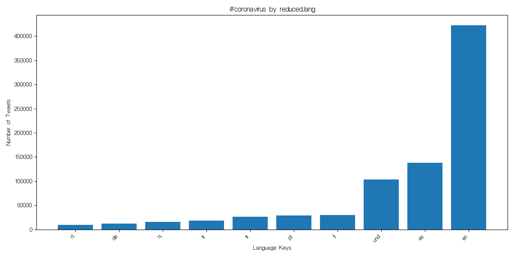
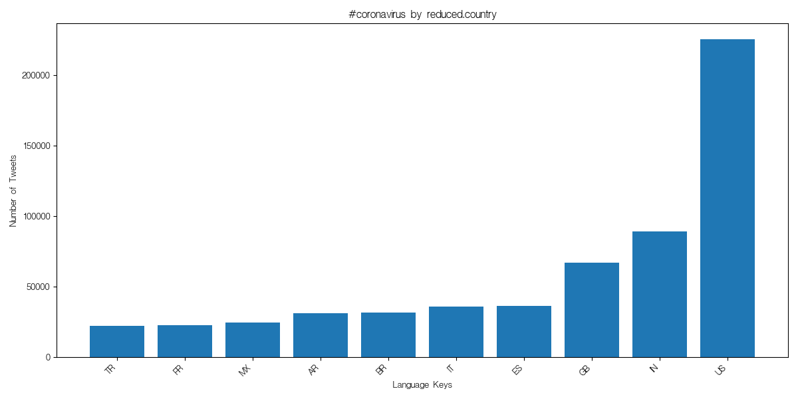
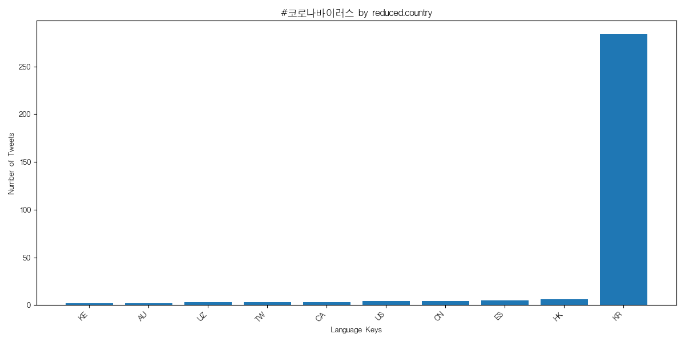
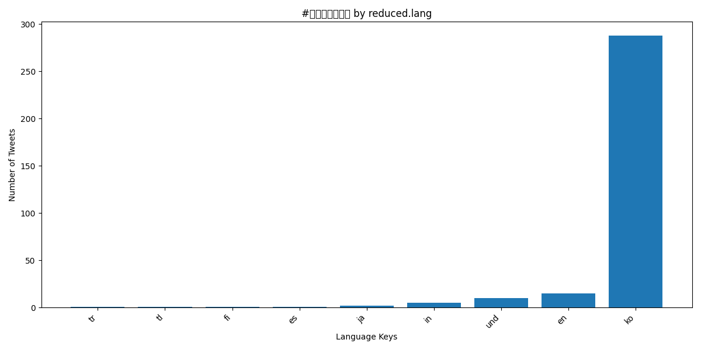
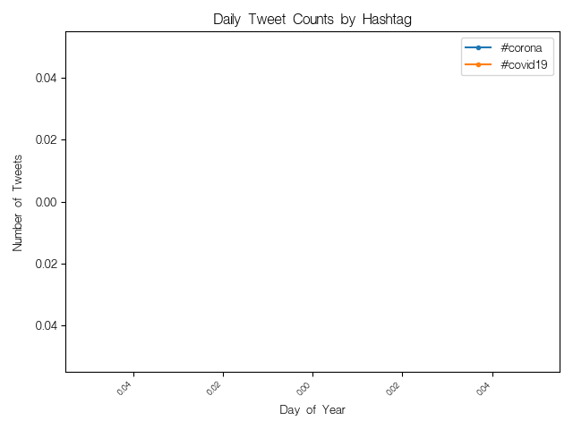

# 2020 Coronavirus Twitter Analysis 

## About the Project
This project analyzes a massive dataset of approximately 1 billion number of geotagged tweets sent throughout the year of 2020 to look through the conversations about the COVID-19 pandemic. In this project, we will look through how people reacted to the growing trend of Coronavirus during 2020, varying from many different languages and countries, by looking through hashtags such as '#coronavirus'.

It will go through the processes of first mapping out every data that scans the JSON tweets and extract the country and language metadata and looks through how frequently COVID tags appears. After the mapping phase it will combine all of the country extracted files and language extracted files into one single file. Then we visualize the entire file of the language or country file. 

## How the Process works
To handle the scale of the dataset, I implemented a  **MapReduce** pipeline using Python and shell scripting:

1. Map Phase (`map.py`): The map.py python function will look through the raw JSON file and collects the country and language metadata and tracks the frequency of COVID related hashtags 
2. Parallel Execution (`run_maps.sh`): Using parallel execution, 'nohup' and '&', 'nohup' will ensure that the function still runs even if I am logged out and '&' would allow each file to run in parallel and thus reducing the run time of looking through all of the files. THis process was done through the lambda server!
3. Reduce Phase (`reduce.py`): A reducer combines all of the '.country' and the '.lang' into one single file.
4. Visualization (`visualize.py` & `alternative_reduce.py`): Finally we visualized using `matplotlib` to generate one for the frequency of tweets from languages and countries as a bar graph. Then using 'alternative_reduce.py' analyzes the time-series analysis.

## Graph Visualization

### 1. Countries and Languages Distributions of '#coronavirus'
These bar charts displays the top 10 languages and countries using the English '#coronavirus' hashtag:

### 2. Countries and Languages Distribution of `#코로나바이러스`
These bar charts display the distribution for the Korean hashtag `#코로나바이러스`, showing the localization of social media trends.

**By Country:**

**By Language:**

### 3. Hashtag Usage Over Time
This time-series plot tracks the usage of `#coronavirus` vs. `#covid19` throughout the year 2020. Initially it would have shown each day of the year, but there are 366 days in 2020, so it would have displayed so many dates, so I made it to just displaying the months and each day is still shown as a data point.

